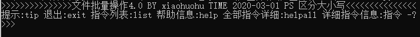
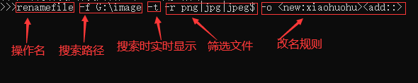
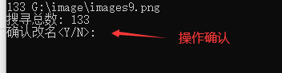
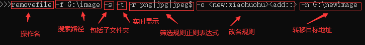

# Bulk-File-Operation
## 文件批量操作 基于python
## 运行时,直接运行FileOS5.0.py即可

警告:切勿对重要文件使用,此程序可能有bug,导致文件丢失无法恢复!!!!!

此程序包含:批量复制,批量搜寻,批量转移,批量交换,批量删除.....

### 文件结构

*****

### 程序截图

****

### 操作规则

**注意:区分大小写**

`操作名 -命令 子项` 其中若存在空格则用 `"`包围即可

例如:

`renamefile -f "c:/xiaohuohu/image/hello world" -s`

*****

### 操作部分列表

**可以通过 `操作名 -?` 来查看详细介绍**

+ `findfile`/`finddur` 搜寻文件/文件夹
+ `copyfile`/`copydur` 复制文件/文件夹
+ `removefile`/`removedir` 转移文件/文件夹
+ `renamefile`/`renamedir` 文件/文件夹改名
+ `exchangefile` 文件交换
+ `deletefile`/`deletedir` 删除文件/文件夹
+ `breaklog` 文件回退(将修改的文件/文件夹恢复原样) 当然删除之类的不可回退
+ `namerule` 改名规则模拟操作(没有文件操作,只是为了检验你写的规则是否符合要求)
+ `looklog` 查看日志文件部分内容
+ `exit` 退出程序
+ `list` 列出所有操作
+ `.....` 其它的自行探索

*****

### 示例 1

#### 要求: 将 `G:\image` 下的所有图片更换名字

#### 操作:

+ 输入操作指令

    

+ 确认操作(供反悔使用)

    

+ 执行完成

    

### 示例 2
#### 要求: 将 `G:\image` 下所有图片(包括子文件夹)改名并转移到 `G:\newimage` 下

#### 操作:

****

### 文件回退

每次执行时添加 `-l` (小写 L) 即可添加日志

在最后会生成一个 `操作名+日期.json` 文件

回退时 执行 `breaklog -f g:/renamefile202003092312.json` 即可回退

### 其它操作请自行探索

`....`

****

### 重要事情说三遍

+ #### 切勿对重要文件使用!!!

+ #### 切勿对重要文件使用!!!

+ #### 切勿对重要文件使用!!!

`老婆`丢失概不赔付(`滑稽保命`)